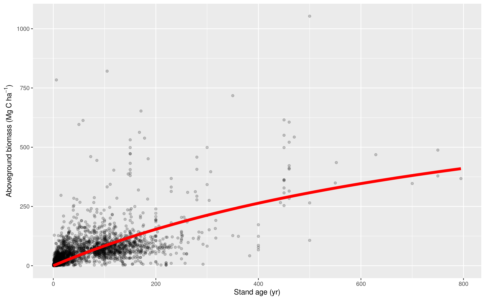

# Figure 1 design
Forest biomass-age growth curves

## Goals

To show additive vs. hierarchical methods to model biomass recovery with
stand age, with the impact from environmental change. Motivated by
Anderson-Teixeira et al. (2013) but don’t make it too similar. Show
innovation!

## Monod growth function

Panel a shows additive, and panel b shows hierarchical.

## Fit Monod model to ForC data

Fit a Monod model to all ForC simplified data, mu = 929.2607, k = 1008.9830.

## Compare growth models
This may go beyond the scope of this paper, but it would be interesting to compare Monod model with commonly used biomass ~ log(stand age + 1) model. FIA data shows Monod model has much lower AIC than log model (Zhu et al. 2018 supplement).

## References

Anderson-Teixeira, K J, A D Miller, J E Mohan, T W Hudiburg, B D Duval,
and E H DeLucia. “Altered Dynamics of Forest Recovery under a Changing
Climate.” Global Change Biology 19, no. 7 (2013): 2001–2021. 
https://doi.org/10.1111/gcb.12194.

Zhu, Kai, Jian Zhang, Shuli Niu, Chengjin Chu, and Yiqi Luo. “Limits to Growth of Forest Biomass Carbon Sink under Climate Change.” Nature Communications 9, no. 1 (2018): 2709–2709. https://doi.org/10.1038/s41467-018-05132-5.
